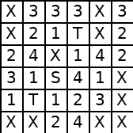
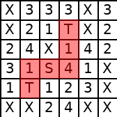

# 🗺️ Treasure Maze — CNN + Ricerca su Grafo (A* / UCS)

Un agente intelligente che **legge un labirinto da un'immagine** (classificando ogni cella con una CNN addestrata da zero), lo modella come problema di ricerca e trova il percorso ottimale per raccogliere i tesori, confrontando **A\*** e **Uniform Cost Search**.

[](https://colab.research.google.com/github/Riccardorossi23/treasure_maze/blob/main/Treasure_Maze/Treasure_Maze_fixed.ipynb)

> Il modo più veloce per provarlo: clicca il badge sopra, poi **Runtime → Esegui tutto** su Google Colab. Nessuna installazione richiesta, gira interamente nel browser.


---

## 🎯 Come funziona

| 1. Immagine di input | 2. Percorso trovato (A\*) |
|---|---|
|  |  |

Ogni cella (28×28px) viene ritagliata e classificata da una CNN in una delle 7 classi: `S` (partenza), `T` (tesoro), `X` (muro abbattibile a costo 5), `1`-`4` (costo di transito). La matrice risultante diventa un problema di ricerca risolto con **A\*** e **Uniform Cost Search** (libreria [AIMA](https://github.com/aimacode/aima-python)), confrontando tempo di esecuzione, costo del percorso e numero di celle esplorate.

## 🧠 Pipeline

1. **Classificazione** (`treasure_maze/classifier.py`) — CNN (Conv2D → MaxPooling → Dense) addestrata su ~3.200 immagini di celle etichettate, salvata su disco per non dover riaddestrare ad ogni esecuzione
2. **Modellazione del problema** (`treasure_maze/maze_problem.py`) — stato = (posizione, tesori raccolti, muri abbattuti); obiettivo: raccogliere tutti i tesori (o almeno *k*)
3. **Ricerca** — A* e Uniform Cost Search a confronto su tempo, costo e celle esplorate
4. **Visualizzazione** (`treasure_maze/visualize.py`) — il percorso trovato viene disegnato sull'immagine originale

## 🚀 Esecuzione in locale

```bash
git clone https://github.com/Riccardorossi23/treasure_maze.git
cd treasure_maze/Treasure_Maze
pip install -r requirements.txt

# Addestra la CNN (una volta sola: i pesi vengono salvati su disco)
python main.py train --data maze_data

# Genera un labirinto di prova e risolvilo
python -c "from treasure_maze.generate_test_maze import save_random_maze_image; save_random_maze_image(6, 'demo_maze.png')"
python main.py solve --image demo_maze.png --debug
```

L'output mostra la matrice classificata, il confronto A\*/UCS in console, e salva `maze_solution.png` con il percorso evidenziato.

## 📁 Struttura

```
Treasure_Maze/
├── main.py                  # CLI: train / solve
├── requirements.txt
├── aima/                    # libreria di ricerca (Problem, astar_search, ucs)
├── maze_data/                # immagini di training (7 classi)
└── treasure_maze/
    ├── classifier.py         # CNN: training, salvataggio/caricamento pesi, estrazione labirinto
    ├── maze_problem.py       # definizione del problema di ricerca
    ├── generate_test_maze.py # generatore di labirinti casuali per il testing
    └── visualize.py          # disegna il percorso sull'immagine originale
```

## 👨‍💻 Autore

**Rossi Riccardo**

